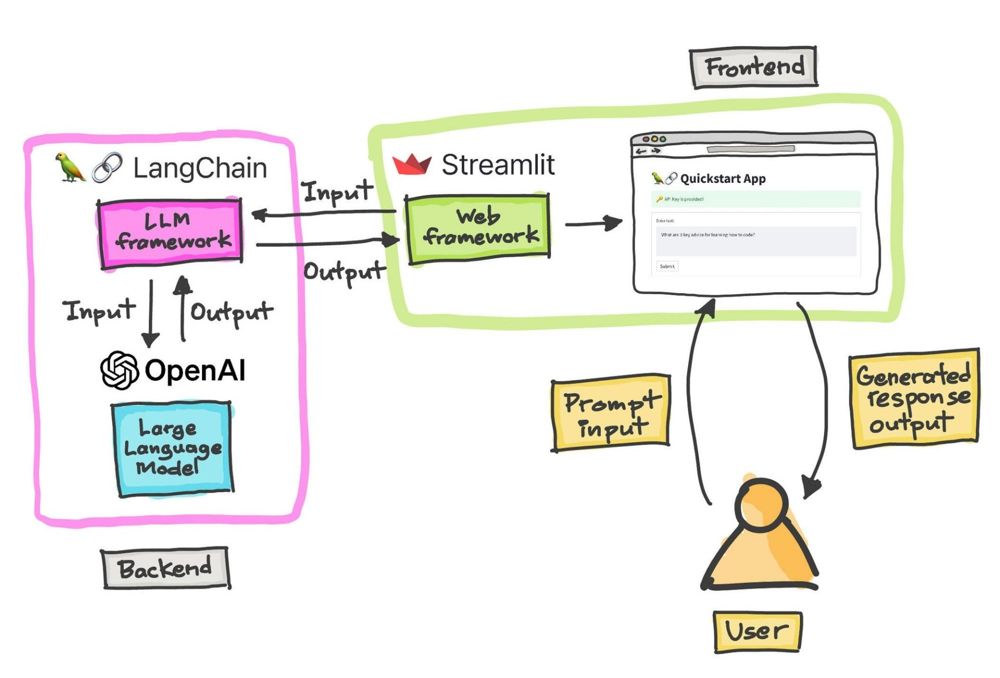

# Listing-Automatization
## Архитектура проекта

<p align="center">
  
</p>

## Структура проекта
```python
doc_analyzer/  
├── app/  
│   ├── core/              # Основные настройки и утилиты  
│   │   ├── config.py      # Конфигурация (API ключи, настройки)  
│   │   └── exceptions.py  # Кастомные исключения  
│   ├── models/            # Модели данных (Pydantic, DB если нужно)  
│   │   └── schemas.py  
│   ├── services/          # Бизнес-логика  
│   │   ├── document_processor.py  # Обработка документов  
│   │   └── qwen_api.py    # Клиент для API Квен  
│   ├── routes/            # Роуты FastAPI  
│   │   └── api.py  
│   └── main.py            # Точка входа  
├── tests/                 # Тесты  
├── requirements.txt       # Зависимости  
└── README.md
```
## Пример работы веб интерфейса v1
https://github.com/user-attachments/assets/4effc72e-3cd0-40e6-9621-811573314a08
## Пример работы веб интерфейса v2
https://github.com/user-attachments/assets/8db7fb20-35c6-4051-ae53-e22e006ee3ce

